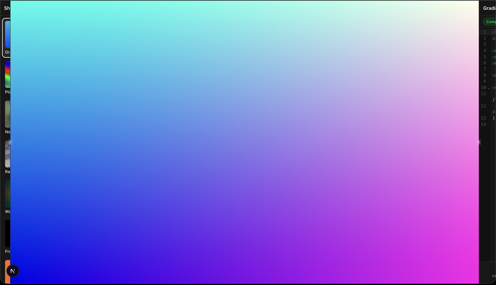

# ShaderMaker

A real-time GLSL fragment shader editor and visualizer built with Next.js and WebGL 2.0.



## Features

- **Live GLSL editing** — Write GLSL ES 3.00 fragment shaders with instant visual feedback
- **CodeMirror 6 editor** — Syntax highlighting, line numbers, and line wrapping
- **7 built-in presets** — Gradient, Plasma, Noise, Raymarching, Waves, Fractal, Voronoi
- **Custom uniform controls** — Auto-detected from GLSL source with interactive sliders
- **Shader management** — Create, duplicate, rename, and delete shaders with right-click context menu
- **Thumbnail previews** — Auto-generated 128x128 previews for each shader
- **Persistent storage** — All shaders saved to localStorage
- **Real-time compilation feedback** — Line-by-line error reporting
- **Mouse interaction** — `u_mouse` uniform tracks cursor position in real-time
- **FPS counter** — Press `F` to toggle performance overlay

## Tech Stack

| Layer | Technology |
|-------|-----------|
| Framework | Next.js 15+ (App Router) |
| Language | TypeScript (strict mode) |
| Styling | Tailwind CSS v4 + shadcn/ui |
| State | Zustand with persist middleware |
| Rendering | Raw WebGL 2.0 |
| Editor | CodeMirror 6 |
| Shaders | GLSL ES 3.00 |

## Getting Started

```bash
# Install dependencies
npm install

# Start development server
npm run dev

# Build for production
npm run build
```

Open [http://localhost:3000](http://localhost:3000) in a WebGL 2.0 compatible browser.

## Built-in Uniforms

Every shader has access to these uniforms automatically:

```glsl
uniform vec2  u_resolution;  // Canvas size in pixels
uniform float u_time;         // Elapsed time in seconds
uniform vec2  u_mouse;        // Mouse position in pixels (origin: bottom-left)
```

## Custom Uniforms

Declare uniforms in your shader and they appear as controls in the right sidebar:

```glsl
uniform float u_zoom;    // range: 0.1, 10.0, default: 1.0
uniform vec2  u_center;  // range: -2.0, 2.0, default: -0.5, 0.0
uniform float u_cells;   // range: 2.0, 20.0, default: 8.0, step: 1.0
```

Supported types: `float`, `int`, `vec2`, `vec3`, `vec4`

Uniforms with "color" in the name get a color picker instead of sliders.

## Keyboard Shortcuts

| Key | Action |
|-----|--------|
| `Ctrl+Enter` | Force recompile |
| `F` | Toggle FPS counter |

## Default Shader Template

New shaders start with this template:

```glsl
#version 300 es
precision highp float;

uniform vec2 u_resolution;
uniform float u_time;

out vec4 fragColor;

void main() {
  vec2 uv = gl_FragCoord.xy / u_resolution;
  fragColor = vec4(uv, 0.5 + 0.5 * sin(u_time), 1.0);
}
```

## Architecture

```
src/
├── app/                    # Next.js App Router
├── components/
│   ├── editor/             # CodeMirror editor, compile status, uniform controls
│   ├── layout/             # App shell, left sidebar, right sidebar
│   ├── shader/             # Canvas, shader cards, shader list
│   └── ui/                 # shadcn/ui primitives
├── lib/
│   ├── glsl/               # Preset shaders, uniform parser
│   └── webgl/              # Renderer, shader compiler, thumbnail capture
├── stores/                 # Zustand stores (shader state, UI state)
└── types/                  # TypeScript type definitions
```

**Key design decisions:**

- WebGL render loop runs in `requestAnimationFrame`, fully decoupled from React
- Zustand store bridges React UI and WebGL renderer imperatively (no re-renders during animation)
- Custom uniform changes dispatched via `CustomEvent` for zero-overhead communication
- CodeMirror loaded dynamically with `ssr: false` to avoid SSR issues
- Fullscreen triangle technique — no vertex buffers needed

## License

MIT
